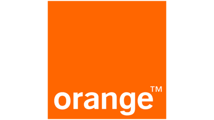
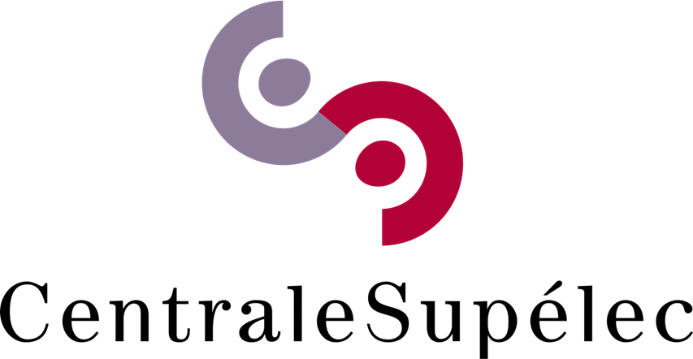
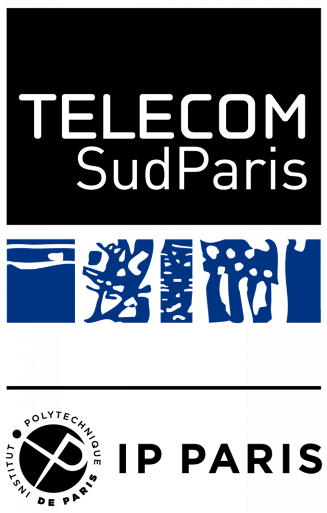
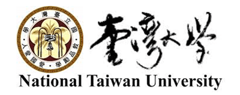
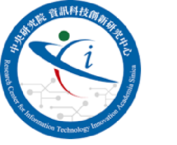

CANCUN is a project of International Collaborative Research between ANR/ France and NSTC/Taiwan.
The consortium consists of:

{width=40% fig-align="center"}

Orange is one of the biggest global telecommunication operators. Orange Research is the worldwide innovation network of the Orange Group which anticipates technological revolutions and conceives tomorrow's technologies. Orange Research brings to the project a broad range of expertise in traffic modeling in fixed and mobile networks as well as experts in machine learning and bandits and has long experience in collaborative research projects in both national and international contexts.
Orange participants : Masucci Antonia Maria (ANR project coordinatoor), Feraud Raphael, Sayrac Berna

{width=40% fig-align="center"}

CentraleSupélec is a top engineering school in France, part of Paris Saclay University. Its international research teams cover different scientific domains. CentraleSupélec joins the CANCUN project with members of the L2S (Laboratoire des Signaux et Systèmes), gathering experts of wireless communications, AI and the joint design of networking and control schemes.
CS participants: El Ayoubi Salah-Eddine (PI), Combes Richard, Rezzouki Marwane, Zitoune Lynda

{width=20% fig-align="center"}

Telecom SudParis is a Grande Ecole of engineering in France, part of Institut Polytechnique de Paris. It hosts seven teaching and research departments, specializing in networking, computer science, physics mathematics, and signal and image processing, and one research laboratory called Samovar. It delivers an IT engineering diploma each year to some 180 engineers, in addition to Master of Science and Specialized Master degrees. It also hosts an incubator. TSP brings its expertise on resource allocation and network optimization.
TSP participants: Chahed Tijani (PI), Ben-Ameur Walid

{width=30% fig-align="center"}

ZettaScale Technology is a tech company (founded in 2022, based in Paris) focused on building advanced distributed computing solutions and communication platforms that span from small embedded devices up to large cloud infrastructures. Its mission is to bring every connected human and machine the unconstrained freedom to communicate, compute and store — anywhere, at any scale, efficiently and securely. 
ZScale participants: Corsaro Angelo (PI), Paez Ivan, Karoui Ramzi

{width=50% fig-align="center"}

National Taiwan University is the 1st university in Taiwan and one of the top ranked universities in the world. It is Taiwan’s oldest and most prestigious public research university, founded in 1928 and its main campus is located in Taipei. It is known  for excellence in science, engineering, medicine, social sciences, and the humanities, as well as for its strong research output and international academic collaborations. NTU join the CANCUN project with members of the Networked Embedded Wireless Systems (NEWS) lab, experts of embedded real-time systems and wireless communication. 
NTU participants: Chi-Sheng Shih (NSTC project coordinator)

{width=30% fig-align="center"}

Research Center for Information Technology Innovation at Academia Sinica was founded in February 2007. The mission is to promote the innovation and application of information technologies, with emphasis on exploring the enabling technology for essential infrastructure and also on integrating inter-disciplinary technologies so as to provide the key ingredients that are invaluable for the upcoming knowledge-based and service-based societies. 
CITI brings expertise in wireless and mobile networking, edge computing, and AIoT.
CITI particicpants: Pang Ai-Chun (PI) 

{width=30% fig-align="center"}

ZettaScale Technology Taiwan is a ZettaScale team located in Taiwan and it is in charge of performance evaluation of communication protocols.
ZScale Taiwan participants: Yuan Yu-Yuan (PI), Kuo Chenying

About this site
