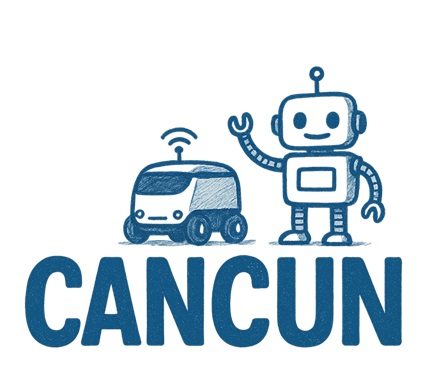

The next generation of mobile networks should enable the seamless operation of Industrial IoT systems, including the time-sensitive control of machines, the distributed perception/decision of autonomous vehicles and the collaboration of robots, while being energy-sober. 
The aim of CANCUN is to provide a goal-oriented communications framework that enables the joint control of the wireless network and the IIoT applications. The envisioned scientific contributions include, on the network side, QoS prediction, 5G and TSN integration and goal-oriented network reconfiguration and, on the IIoT applications side, collaborative perception and distributed path and task planning. 
CANCUN framework will start from the IIoT application goal and a high level task planning provided by a central controller, and deduce a corresponding network configuration/reconfiguration planning that is expected to achieve the requirements of the application with a large confidence. Once the tasks are launched and the mobile robots/vehicles start executing the tasks, the wireless network reconfigures and strives to continuously achieve the goal of the application. The levers for capacity and coverage provisioning will be the radio resource allocation and the flexible integration of wireless interfaces and mmWave small cells, while reinforcement learning (and in particular Multi-Armed Bandits) will be the privileged tool in CANCUN for learning the optimal network configuration. The goal-oriented approach operates on two fronts. First, the network controller, being aware of the application goal, devises an optimal scheduling and resource allocation policy that selectively samples sources whose data are expected to have the largest impact on the application goal. Second, a joint QoS and traffic prediction will lead, on the sources side, to a continuous adaptation of the operation mode and the generated traffic to the network status. Such a goal-oriented paradigm is advocated by CANCUN as an essential enabler for sustainability in industrial 6G networks, as it permits transmitting the minimal amount of traffic needed for achieving the application goal, instead of constantly respecting a target QoS (in terms of data rate and latency), as for URLLC in 5G networks. The main targets of CANCUN are scenarios with autonomous low speed vehicles (ALSV), such as industrial areas and campus, where safety has to be ensured despite the harsh environment and the absence of traffic signalling


For a demonstration of a line plot on a polar axis, see @fig-polar.

```{python}
#| label: fig-polar
#| fig-cap: "A line plot on a polar axis"

import numpy as np
import matplotlib.pyplot as plt

r = np.arange(0, 2, 0.01)
theta = 2 * np.pi * r
fig, ax = plt.subplots(
  subplot_kw = {'projection': 'polar'} 
)
ax.plot(theta, r);
ax.set_rticks([0.5, 1, 1.5, 2]);
ax.grid(True);
plt.show()
```
